<picture>
  <source media="(prefers-color-scheme: dark)" srcset="./assets/header-dark.svg" />
  
</picture>

 

Soy **desarrollador fullstack** y me defino como **builder**: me gusta llevar una idea de cero a un producto andando, desde la interfaz hasta la API y la base de datos.

Mi fuerte es el **frontend**. Con React, Next.js y TypeScript armo interfaces cuidadas al detalle, con animaciones y una experiencia de uso que se siente bien. Del lado del servidor trabajo con NestJS y PostgreSQL.

Valoro el código limpio, las arquitecturas mantenibles y las soluciones prácticas.

 

**Frontend**&emsp;React · Next.js · TypeScript · JavaScript · Astro · Vite · Tailwind · Three.js · GSAP · Framer Motion

**Backend**&emsp;Node.js · NestJS · Express · PostgreSQL · Prisma

**Herramientas**&emsp;Git · GitHub · GitLab · VS Code · Postman · Jira · DBeaver · TablePlus

 

[LinkedIn](https://www.linkedin.com/in/fernando-lopez-b80182290/) &nbsp;·&nbsp; [Correo](mailto:ferlopeztrh@gmail.com) &nbsp;·&nbsp; [WhatsApp](https://wa.me/595991703989)
