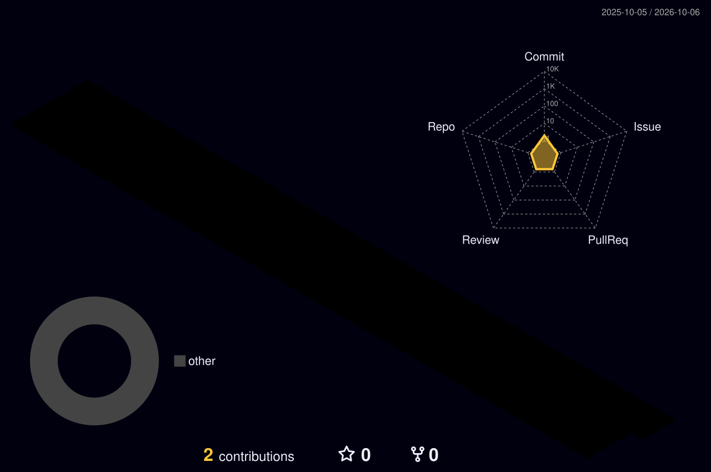

 

  

 

<table>
<tr>
<td width="52%" valign="top">

### Sobre mí

Soy **Frontend Developer en BEPSA / Dinelco**, especializado en sistemas de procesamiento de pagos y aplicaciones fintech. Construyo interfaces de **checkout, pasarelas de pago y plataformas para desarrolladores** con React, Next.js y TypeScript.

Me enfoco en experiencias fluidas y seguras para transacciones financieras: integración de APIs de pago, autenticación y flujos donde cada detalle importa. También trabajo el backend con **NestJS y PostgreSQL**.

Valoro el código limpio, las arquitecturas mantenibles y las soluciones prácticas. Siempre estoy aprendiendo algo nuevo.

</td>
<td width="48%" valign="top" align="center">

</td>
</tr>
</table>

### Stack

  
    
  

  
  
  
  
  

### Actividad

  

  <picture>
    <source media="(prefers-color-scheme: dark)" srcset="https://raw.githubusercontent.com/ferlopeztrh/ferlopeztrh/output/github-snake-dark.svg" />
    <source media="(prefers-color-scheme: light)" srcset="https://raw.githubusercontent.com/ferlopeztrh/ferlopeztrh/output/github-snake.svg" />
    
  </picture>

